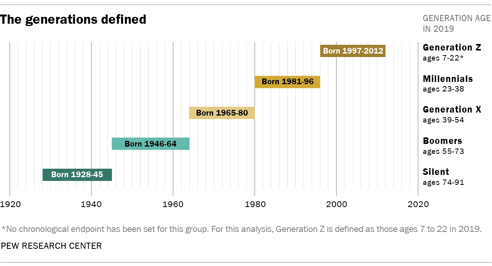
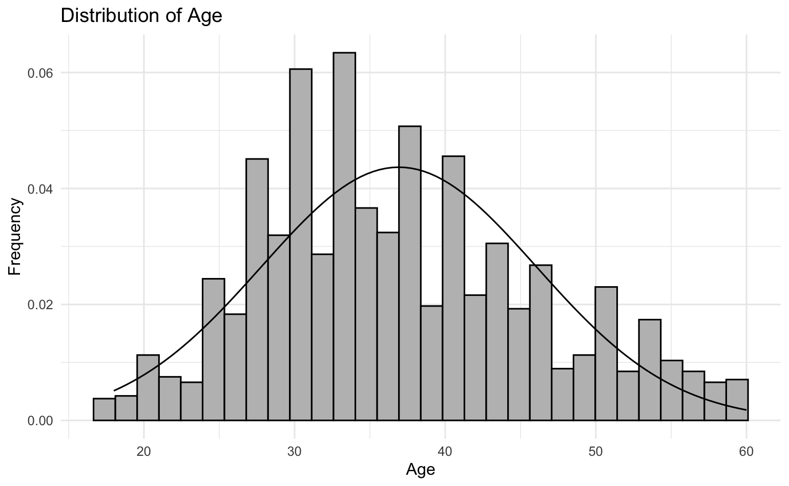

# Are Millennials more likely to quit?

# Introduction

<!-- Describe the main research questions or goals of your data analysis. -->

Anyone born between 1981 and 1996 (ages 23 to 38 as of 2019) is
considered to be a **Millennial**. Here is a helpful chart to get a more
visual distinction of the different generations we’ll be dealing with,
in this project.

Image Source : Pew Research Center \[1\]

The U.S. Bureau of Labor Statistics reported that the median age of US
working population as of 2021 is 41.7, and projects the median age to
increase to 42.6 by the year 2031
[\[2\]](https://www.bls.gov/emp/tables/median-age-labor-force.htm).
This is not a good trend, because the younger generation usually helps
support the older generation, and the increasing trend indicates that
the bigger older population would have to get support from a much
smaller population of the younger working generation. The current and
the near future working population would mostly be comprised of
Millennials.

We are living in a strange time, where we’re seeing an increase in the
level of education throughout the nation, and yet the rate of labor
force participation of the population age 25 and over is falling for all
education
groups[\[3\]](https://www.census.gov/newsroom/press-releases/2020/educational-attainment.html).
Many millennials, on a very large scale, are quitting their jobs, a
phenomenon known as **The Great
Resignation**[\[4\]](https://en.wikipedia.org/wiki/Great_Resignation),
and yet others are doing a silent revolution, where they have restricted
their participation to the bare minimum, a phenomenon known as **Quiet
Quitting**[\[5\]](https://en.wikipedia.org/wiki/Quiet_quitting).

We take a look at a dataset to look if it’s really the case that
Millennials are more likely to quit, or is there some other confounding
variable that is causing these changes in the work force. We’ll also
check other trends that correlate with the attrition, like overall job
satisfaction

# Data Description

<!-- Briefly describe your data set. What is the source? What is the dimension (number of rows and columns)? What are the variables of interest? -->

IBM HR Analytics Employee Attrition &
Performance[\[6\]](https://www.kaggle.com/datasets/pavansubhasht/ibm-hr-analytics-attrition-dataset)
is a dataset created by IBM scientists to predict attrition of any
particular employee. This dataset was taken from Kaggle and was last
updated 6 years ago (in 2016). The Great Resignation and Quiet Quitting
are relatively recent phenomenon, so we’ll use this dataset to check
whether the trend had been going on before the outbreak of Covid-19.

We’ll be categorizing different people into different age groups (or
generations) and contrast the attrition rate of those generations, and
compare other potentially confounding factors as well.

The dataset has 1470 rows and 35 columns. After removing IDs, constant
columns, and other irrelevant columns, we are left with these columns of
interest/potential confounders:

1.  Age (main predictor) : Age of the employees
2.  Attrition (outcome): Whether they left the company or not
3.  MonthlyIncome : the amount of money employees are paid per month.
    Maybe the younger generation are being paid less purely because of
    their age
4.  Education : On a scale of 1 to 5. How educated they are
5.  EnvironmentSatisfaction : On a scale of 1 to 4, how satisfied are
    people with their job environment
6.  JobInvolvement : On a scale of 1 to 4, how involved are people with
    their jobs
7.  JobLevel : On a scale of 1 to 5, how high is their job position.
8.  JobSatisfaction : On a scale of 1 to 4, how satisfied employees are
    with their jobs
9.  OverTime : 1 for “Yes” and 0 for “No”, representing whether they the
    emplyees do overtime or not
10. MonthlyIncome : The monthly compensation an employee gets
11. NumCompaniesWorked : Number of companies an employee has worked
    before joining IBM
12. PercentSalaryHike : Salary hike from the last job they worked, or
    the last promotion they received
13. WorkLifeBalance : On a scale of 1 to 4, how good is their work-life
    balance

# Results

<!-- Present your main results. This should be some kind of compelling visualization(s) of your data. But you may also present a table of summary statistics, or the output of a statistical model (with clearly defined response and predictors). Be selective about the results you choose to include. A single high quality visualization is preferable to a large number of mediocre visualizations. This section should also include some written interpretation of your results.
-->

  The distribution of Attrition looks like a bimodal distribution
and right of the bat, we can see very clearly that younger people have
the highest rates of attrition being more than 40%. We could argue that
younger people are leaving the company to go for higher educations and
better job opportunities, both of which are the most common reasons to
leave the company at the beginning of the career.  And in contrast,
the attrition rate also increases at the higher end, probably people in
the high age are more susceptible quitting their jobs due to some
illness and are, in general, more likely to opt for an early retirement.
The attrition rate of the Millennials can be seen to be higher than that
of Generation X (the generation above them from the range of 39-54).

| Generation | avg_MonthlyIncome | avg_JobLevel | count_OverTime | avg_JobSatisfaction |
|-----------|-----------------|-------------|--------------|------------------|
| Gen-Z      | 2500              | 1            | 23             | 3                   |
| Millennial | 4377              | 2            | 225            | 3                   |
| Gen-X      | 6811              | 2            | 141            | 3                   |
| Boomer     | 10312             | 3            | 27             | 3                   |

Other factors, like JobInvolvement, PercentSalaryHike,
RelationshipSatisfaction and WorkLifeBalance either show expected
trends, or no trend whatsoever.

Although the number of OverTimes seems to be significantly higher for
Millennials, a quick look at the population distribution signals that
this pattern is to be expected

All this points to the conclusion there was no abnormality in job market
before Covid-19 epidemic, and that Millennials quitting their job has to
do more with the Epidemic itself, than the market

# Further Research

This research could be improved if we had a more historical data of all
the employee attrition across multiple other companies from various
areas of market expertise.

# References

1.  [The generations
    defined](https://www.pewresearch.org/fact-tank/2019/01/17/where-millennials-end-and-generation-z-begins/ft_19-01-17_generations_2019/)
2.  [Median age of the labor force, by sex, race and
    ethnicity](https://www.bls.gov/emp/tables/median-age-labor-force.htm)
3.  [U.S. Census Bureau Releases New Educational Attainment
    Data](https://www.census.gov/newsroom/press-releases/2020/educational-attainment.html)
4.  [Great Resignation](https://en.wikipedia.org/wiki/Great_Resignation)
5.  [Quiet Quitting](https://en.wikipedia.org/wiki/Quiet_quitting)
6.  [IBM HR Analytics Employee Attrition &
    Performance](https://www.kaggle.com/datasets/pavansubhasht/ibm-hr-analytics-attrition-dataset)
